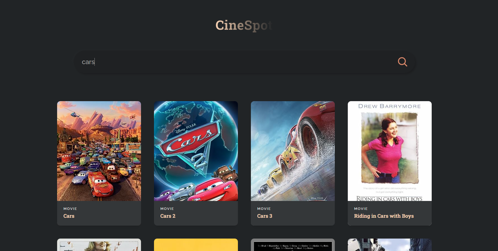

# Movie Search App

## Description

Simple and user-friendly web application built with React and OMDb API.

## Prerequisites

- **Node.js**: Ensure you have Node.js installed on your system. You can download Node.js from [nodejs.org](https://nodejs.org/).
- **npm**: Package manager for JavaScript. npm is included with Node.js.
- **Visual Studio Code**: Download and install VSCode from [code.visualstudio.com](https://code.visualstudio.com/).

## Installation

1. **Clone the Repository**:

    `git clone https://github.com/dgrabo/movie-search-react` 

2. **Install Dependencies**:

    `npm install`

## API Key Setup

This app uses the [OMDb API](http://www.omdbapi.com/) to fetch movie data. To use this API, you need an API key.

1. **Obtain an API Key**:
    - Sign up at [OMDb API](http://www.omdbapi.com/apikey.aspx) to get your API key.

2. **Set Up the API Key**:
    - In App.js file, change the API_URL variable with your API key   
  `const API_URL = 'http://www.omdbapi.com?apikey=*YOUR_KEY*`

## Running the App

**Start the Development Server**:

Using npm: `npm start`

## Screenshot 
Here's a screenshot of the app in action:

## Acknowledgements
Powered by [OMDb API](http://www.omdbapi.com/).